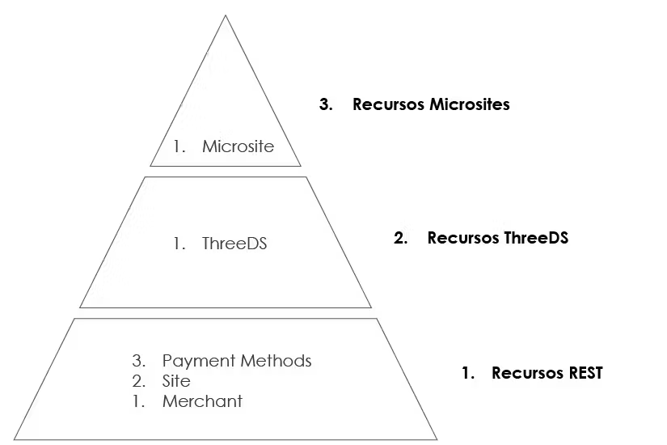

# Jerarquia y grupos

Los recursos que se crean por medio de la API están divididos por jerarquías y en un orden determinado, esto con el fin de poder conservar la individualidad entre los diferentes aplicativos en donde se crean los recursos, a continuación, se muestran los grupos y el orden de creación:

Basado en lo anterior, en caso de que se realice una petición solicitando varios grupos, en caso de que falle un grupo de nivel superior, se conservarán los recursos pertenecientes a grupos de menor rango, a continuación, se expone un escenario de ejemplo:

Se envía una petición al endpoint “api/integration/create-from-merchant” con los siguientes objetos:

* merchant
* site
* threeDS
* paymentMethods

Suponiendo que la creación de los “paymentMethods" falla, se realizará el rollback del “site” y del “merchant”, pero no del “threeDS”, posterior a esto, se recibirá la notificación con el resultado de la petición, allí se podrá encontrar la llave de “threeDS” con el token creado, el cual, servirá para volver a enviar la petición, pero esta vez enviando unicamente el token creado dentro del objeto de “threeDS” del JSON.

Lo explicado en el parrafo anterior se aplica también para la creación del micrositio, en caso de que este falle pero el resto de la petición sea exitosa, podrá apuntar al endpoint “api/microsite/create” para crearlo de manera individual, enviando únicamente el webhook y el ID del sitio en panel (panelId).